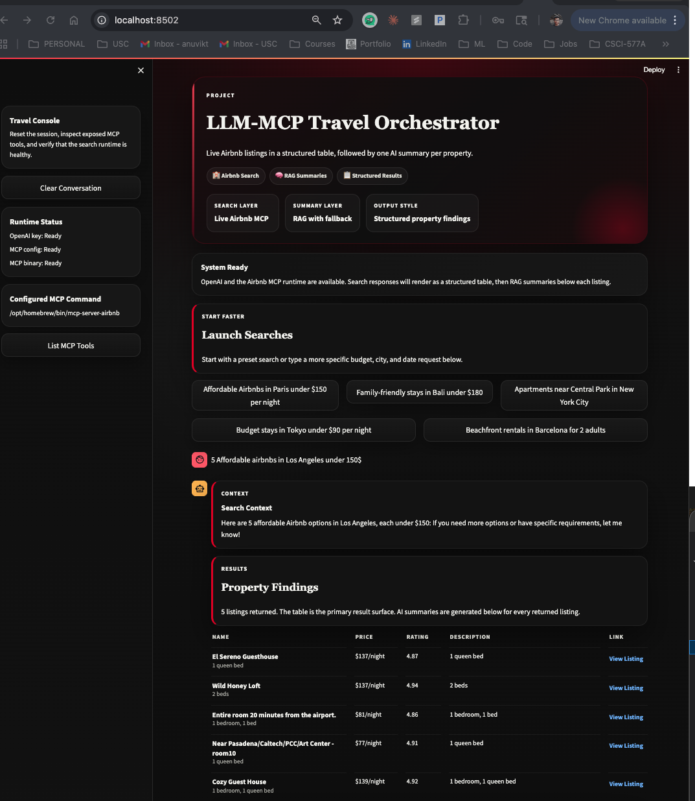
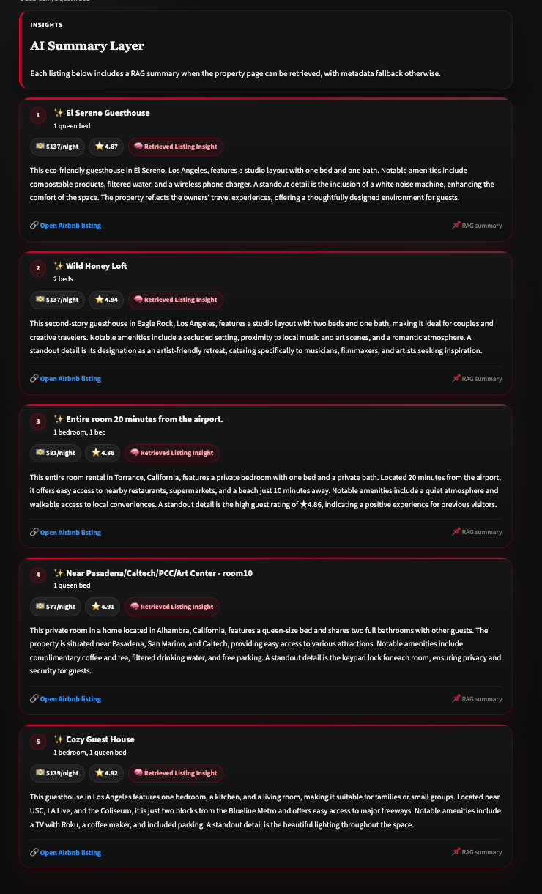
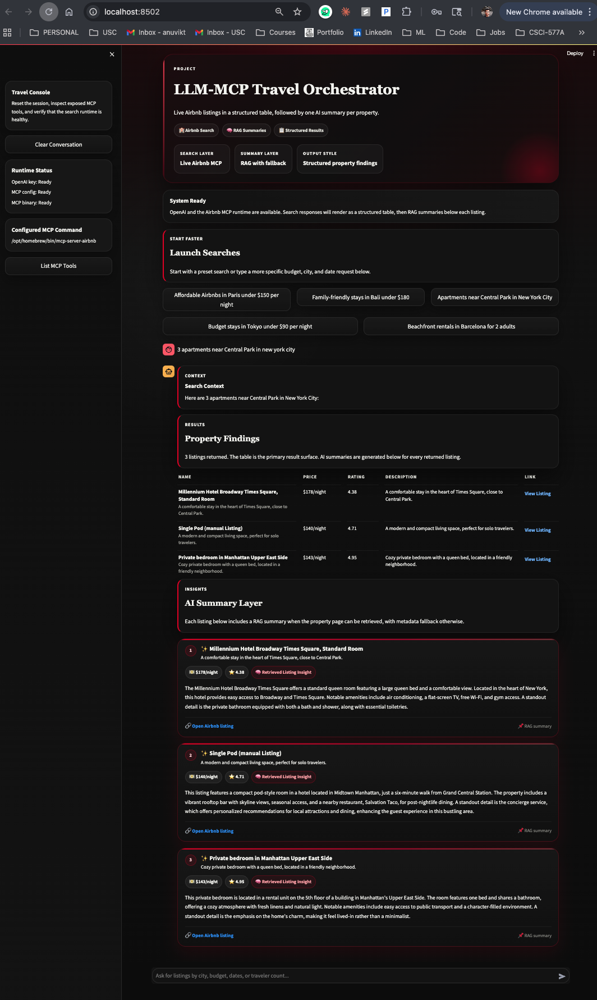
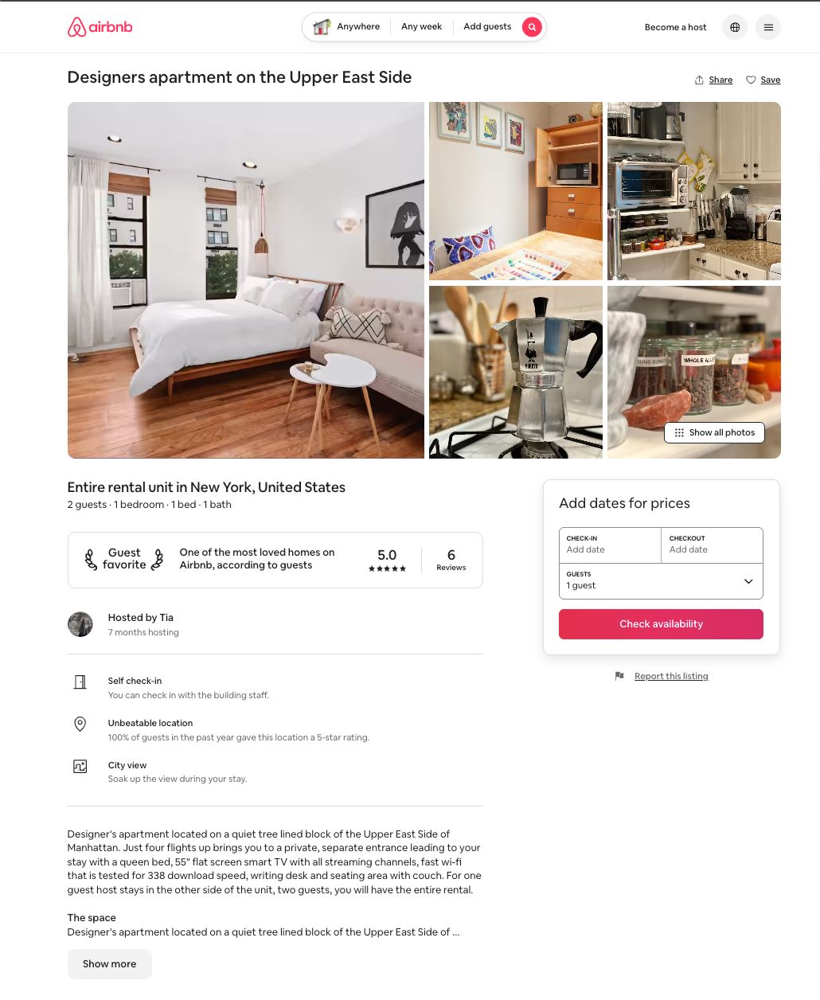

# LLM-MCP Travel Orchestrator

Streamlit travel search app for live Airbnb discovery, structured listing output, and AI-generated property summaries.

It combines:

- live Airbnb search through an MCP server
- `gpt-4o-mini` for query handling and listing summarization
- `text-embedding-3-large` for retrieval on scraped listing content
- a RAG summary layer with metadata fallback when scraping is weak or blocked
- a structured results table plus per-listing AI insight cards

The main app module is `chatbot.py`.
For Streamlit Community Cloud, use `streamlit_app.py` as the main file path.


## AI Stack

Current configured models in the codebase:

- chat/search orchestration: `gpt-4o-mini`
- listing summary generation: `gpt-4o-mini`
- embeddings: `text-embedding-3-large`

| Layer | Model / Component | Role |
| --- | --- | --- |
| Search | Airbnb MCP server | Returns live Airbnb listings from user queries |
| Reasoning | `gpt-4o-mini` | Interprets the travel request and drives the search flow |
| Embeddings | `text-embedding-3-large` | Turns listing content into vectors for retrieval |
| Retrieval | FAISS | Finds the most relevant listing chunks for summary generation |
| Summary | `gpt-4o-mini` | Produces concise, readable listing summaries |

## Why This Setup

- The app currently uses `gpt-4o-mini`, not `gpt-4o`.
- `gpt-4o-mini` keeps the app fast enough for interactive travel search while still being strong at query interpretation and concise summarization.
- `text-embedding-3-large` is used where semantic retrieval matters more than generation speed: identifying the most relevant listing details from scraped page content.
- RAG improves summary quality by grounding the output in listing-specific text instead of relying only on name, price, and short descriptions.
- Metadata fallback keeps the app usable even when Airbnb pages are blocked, sparse, or not reliably scrapeable.

## What It Does

- Accepts natural-language travel stay requests such as city, budget, dates, and guest count
- Calls the Airbnb MCP server for live listing results
- Parses tool output into structured property rows
- Renders listings in a stable tabular layout inside Streamlit
- Generates an AI summary for each property
- Uses retrieved listing content when possible and falls back to listing metadata when scraping is limited
- Surfaces runtime and configuration issues directly in the UI

## Current App Flow

1. User enters a request in the Streamlit app.
2. `chatbot.py` sends the request through `MCPAgent` using the Airbnb MCP server configured in `airbnb_mcp.json`.
3. Assistant output is parsed by `listing_parser.py`.
4. Listings are shown in a structured results table.
5. `rag.py` generates one summary per property:
   - preferred path: scrape, chunk, embed, retrieve, summarize
   - fallback path: summarize from listing metadata already returned by search

## How The AI Pipeline Works

```text
User Query
   -> GPT-4o mini interprets budget, city, dates, guest count
   -> Airbnb MCP server returns live listing results
   -> listing_parser.py converts response into structured rows
   -> rag.py fetches listing page content when available
   -> text-embedding-3-large creates embeddings for listing chunks
   -> FAISS retrieves the most relevant chunks
   -> GPT-4o mini writes a concise summary
   -> if retrieval fails, fallback summary is built from metadata
```

## Project Structure

```text
LLM-MCP-Travel-Orchestrator/
├── chatbot.py                    # Main Streamlit app
├── rag.py                        # RAG + metadata fallback summary pipeline
├── listing_parser.py             # Structured parsing helpers for assistant output
├── airbnb_use.py                 # Simple CLI example
├── airbnb_mcp.json               # MCP server configuration
├── requirements.txt              # App dependencies
├── pyproject.toml                # Project metadata and tooling config
├── pytest.ini
├── mcp_use/                      # MCP client/agent implementation
├── tests/
│   └── unit/
├── assets/images/                # Screenshots
└── docs/
```

## Prerequisites

- Python 3.11 or higher
- Node.js and npm
- OpenAI API key
- Airbnb MCP server binary available on the machine

## Installation

### 1. Clone the repository

```bash
git clone https://github.com/ANUVIK2401/LLM-MCP-Travel-Orchestrator.git
cd LLM-MCP-Travel-Orchestrator
```

### 2. Create and activate a virtual environment

```bash
python -m venv venv
source venv/bin/activate
```

On Windows:

```bash
venv\Scripts\activate
```

### 3. Install Python dependencies

```bash
pip install -r requirements.txt
```

### 4. Install the Airbnb MCP server

```bash
npm install -g @openbnb/mcp-server-airbnb
```

### 5. Configure your environment

Create a `.env` file in the project root:

```env
OPENAI_API_KEY=your_api_key_here
```

### 6. Verify `airbnb_mcp.json`

The repo currently expects the Airbnb MCP server command in `airbnb_mcp.json`.

Example:

```json
{
  "mcpServers": {
    "airbnb": {
      "command": "/opt/homebrew/bin/mcp-server-airbnb",
      "args": ["--ignore-robots-txt"]
    }
  }
}
```

If your install path is different, update the `command` field accordingly.

## Run Locally

Start the Streamlit app:

```bash
streamlit run chatbot.py
```

Then open the local URL shown by Streamlit.

You can also run the Streamlit Cloud wrapper locally:

```bash
streamlit run streamlit_app.py
```

## UI Overview

The current UI includes:

- runtime diagnostics in the sidebar
- quick-search presets
- structured property results table
- AI summary cards for each listing
- error surfacing when MCP, OpenAI, or network configuration is incomplete

## Screenshots

<table>
  <tr>
    <td align="center" valign="top">
      <strong>Main Interface</strong><br/><br/>
      
    </td>
    <td align="center" valign="top">
      <strong>Structured Results</strong><br/><br/>
      
    </td>
  </tr>
  <tr>
    <td align="center" valign="top">
      <strong>AI Summary Cards</strong><br/><br/>
      
    </td>
    <td align="center" valign="top">
      <strong>Additional View</strong><br/><br/>
      
    </td>
  </tr>
</table>

## RAG Summary Behavior

`rag.py` is built to be practical, not fragile.

Instead of assuming every listing page is fully scrapeable, the app uses a two-path summary design:

### Path 1: Retrieved Summary

Used when the listing page provides enough usable text.

- fetch the Airbnb listing page
- extract metadata plus visible body content
- split the content into chunks
- embed the chunks with `text-embedding-3-large`
- retrieve the most relevant chunks with FAISS
- ask `gpt-4o-mini` to write a short factual summary

### Path 2: Metadata Fallback

Used when scraping or retrieval is weak.

- listing name
- price
- rating
- description returned by the search

This fallback means the UI still shows useful summaries even when full page retrieval is not possible.

### Why The RAG Layer Helps

- It gives summaries grounded in listing-specific text rather than generic model guesses.
- It surfaces concrete details such as layout cues, amenities, and neighborhood hints.
- It keeps summaries short enough for fast comparison across multiple listings.
- It degrades gracefully instead of failing hard when a listing page is blocked.

## Testing

Run focused unit tests:

```bash
pytest -q tests/unit/test_listing_parser.py tests/unit/test_rag.py
```

Run the full test suite:

```bash
pytest -q
```

## Deployment Notes

### Streamlit Community Cloud

Before deploying, make sure the following are addressed:

- main file path is set to `streamlit_app.py`
- Python version is set to `3.11` in the Streamlit Community Cloud app settings for the safest redeploy path
- `OPENAI_API_KEY` is configured in Streamlit secrets
- Node.js and npm are available through `packages.txt`
- `airbnb_mcp.json` launches the Airbnb MCP server with `npx`

Important: this app depends on the Airbnb MCP server process at runtime. The repo is now configured to launch it portably with `npx`, which is more suitable for Streamlit Cloud than a machine-specific Homebrew path.

## Troubleshooting

### The app says the MCP server is not responding

Check:

- `airbnb_mcp.json` exists
- the `command` path is correct
- the MCP binary runs locally

### Summaries fall back to metadata

This is expected when:

- a listing page blocks scraping
- the page does not expose enough usable content
- retrieval returns weak context

### Streamlit UI loads but searches fail

Check:

- `OPENAI_API_KEY` is set
- the MCP server starts successfully
- your environment can reach OpenAI

## Key Files

- `chatbot.py`: main Streamlit app, UI rendering, runtime diagnostics, MCP query flow
- `listing_parser.py`: parsing and normalization of assistant listing output
- `rag.py`: listing summarization pipeline with RAG and fallback behavior
- `mcp_use/agents/langchain_agent.py`: LangChain tool adapter layer used by the MCP agent
- `airbnb_mcp.json`: MCP server process configuration

## Contributing

1. Create a feature branch.
2. Make your changes.
3. Run tests.
4. Verify the Streamlit app locally.
5. Open a pull request.

## License

This project is licensed under the MIT License. See [LICENSE](LICENSE).
