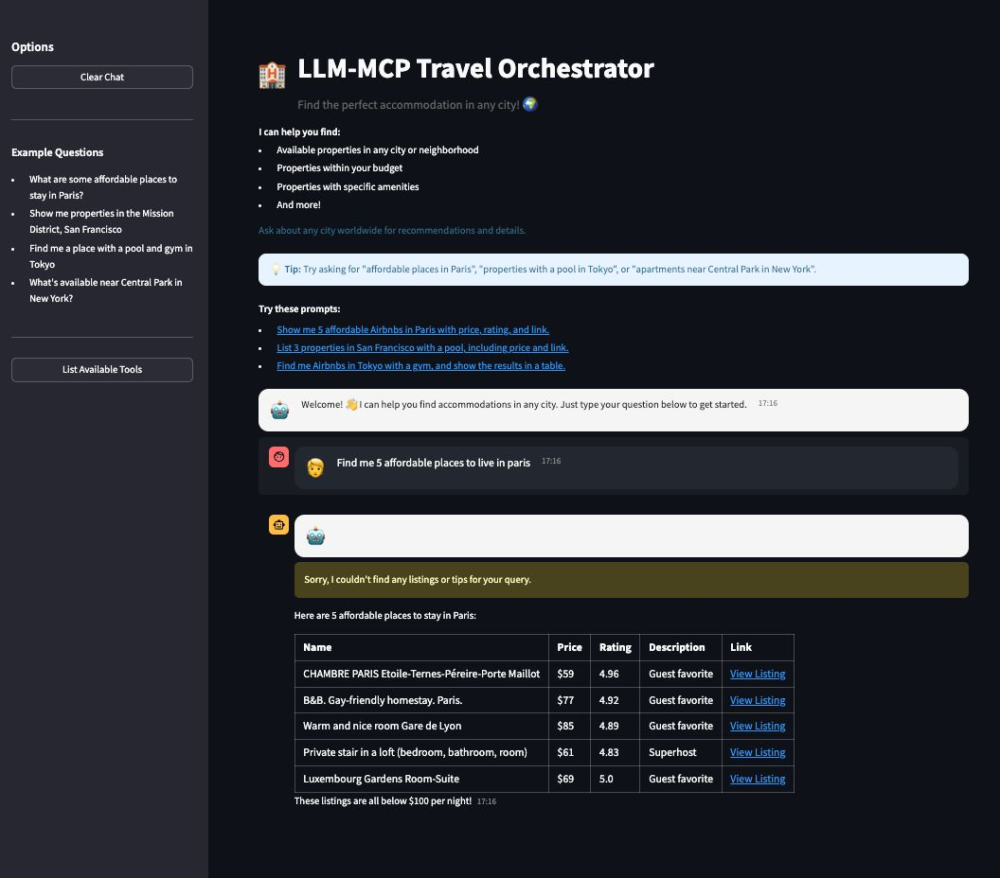

# 🤖 LLM-MCP Travel Orchestrator

A sophisticated multi-agent travel accommodation system leveraging OpenAI's GPT-4o-mini, LangChain, and the Multi-Agent Collaboration Protocol (MCP) to provide intelligent property search and recommendations. This system orchestrates multiple AI agents for query parsing, filtering, summarization, and real-time accommodation recommendations.


---

## 🧠 Technical Architecture

### Multi-Agent System
- **LLM Orchestration**
  - GPT-4o-mini powered natural language understanding
  - Multi-agent collaboration for complex tasks
  - Context-aware conversation management
  - Intelligent response generation
- **LangChain Integration**
  - Chain-of-thought reasoning
  - Tool-based execution
  - Memory management
  - Response formatting
- **MCP Server Integration**
  - Real-time property data access
  - Asynchronous communication
  - Robust error handling
  - Efficient data retrieval

### Core Components
1. **LLM Agent Layer**
2. **LangChain Integration Layer**
3. **MCP Integration Layer**
4. **User Interface Layer**

---

## 🚀 Getting Started

### Prerequisites
- Python 3.11 or higher
- Node.js and npm
- OpenAI API key ([Get one here](https://platform.openai.com))

### Installation

1. **Clone the Repository**
```bash
git clone https://github.com/ANUVIK2401/LLM-MCP-Travel-Orchestrator.git
cd LLM-MCP-Travel-Orchestrator
```

2. **Set Up Virtual Environment**
```bash
python -m venv venv
# Activate virtual environment
# On macOS/Linux:
source venv/bin/activate
# On Windows:
.\venv\Scripts\activate
```

3. **Install Dependencies**
```bash
pip install -r requirements.txt
npm install -g @openbnb/mcp-server-airbnb
```

4. **Configure Environment**
Create a `.env` file in the project root and add your OpenAI API key:
```env
OPENAI_API_KEY=your_api_key_here
```
> ⚠️ **Important**: Never commit your `.env` file or share your API key. The `.env` file is already in `.gitignore` for security.

### Running the Application

```bash
streamlit run chatbot.py
```
Then open your browser and navigate to: [http://localhost:8501](http://localhost:8501)

---

## 💡 Usage Guide

- Property search by location
- Amenity-based filtering
- Price range specifications
- Location-based recommendations
- Multi-agent collaboration
- Context-aware conversations
- Dynamic filtering options
- Personalized recommendations

---

## 📸 Screenshots

| Main Chatbot Interface | Property Search Results |
|:---------------------:|:----------------------:|
|  |  |

| Multi-Agent Collaboration | Real-Time Recommendations |
|:------------------------:|:------------------------:|
|  |  |

---

## 🗂️ Project Structure

```
LLM-MCP-Travel-Orchestrator/
├── assets/
│   └── images/
├── chatbot.py
├── airbnb_use.py
├── airbnb_mcp.json
├── requirements.txt
├── pyproject.toml
├── pytest.ini
├── LICENSE
├── .gitignore
├── docs/
├── mcp_use/
│   ├── agents/
│   ├── connectors/
│   ├── task_managers/
│   ├── client.py
│   ├── config.py
│   ├── logging.py
│   ├── session.py
│   └── __init__.py
├── tests/
│   ├── conftest.py
│   └── unit/
│       ├── test_client.py
│       ├── test_config.py
│       ├── test_http_connector.py
│       ├── test_logging.py
│       ├── test_session.py
│       └── test_stdio_connector.py
└── venv/
```

---

## 📚 Documentation

- See the `docs/` directory for detailed guides, quickstart, and API reference.
- Example: [docs/introduction.mdx](docs/introduction.mdx), [docs/quickstart.mdx](docs/quickstart.mdx)

---

## 🛠️ Development

1. Fork the repository
2. Create a feature branch
3. Set up your development environment
4. Make your changes
5. Test thoroughly (see `tests/` directory)
6. Submit a pull request

### Key Dependencies
- streamlit==1.32.0
- python-dotenv==1.0.0
- mcp-use==1.1.5
- langchain-openai>=0.0.5
- langchain-community>=0.0.34
- langchain>=0.1.16

---

## 🔒 Security Considerations

- Keep your API keys secure
- Never commit sensitive information
- Use environment variables
- Regular dependency updates
- Follow security best practices

---

## 🤝 Contributing

1. Fork the repository
2. Create your feature branch (`git checkout -b feature/AmazingFeature`)
3. Commit your changes (`git commit -m 'Add some AmazingFeature'`)
4. Push to the branch (`git push origin feature/AmazingFeature`)
5. Open a Pull Request

---

## 📝 License

This project is licensed under the MIT License - see the [LICENSE](LICENSE) file for details.

---

## 🙏 Acknowledgments

- [openbnb-org/mcp-server-airbnb](https://github.com/openbnb-org/mcp-server-airbnb) for the MCP server
- OpenAI for the GPT models
- LangChain for the agent framework
- Streamlit for the web framework

## 📞 Support

For support:
1. Check the [Issues](https://github.com/ANUVIK2401/LLM-MCP-Travel-Orchestrator/issues) page
2. Create a new issue if your problem isn't already listed
3. Contact the maintainers for urgent issues

---

Made with ❤️ by [Anuvik Thota]
