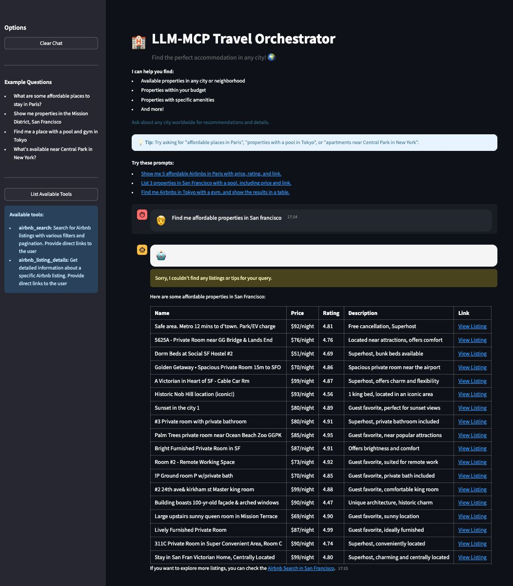
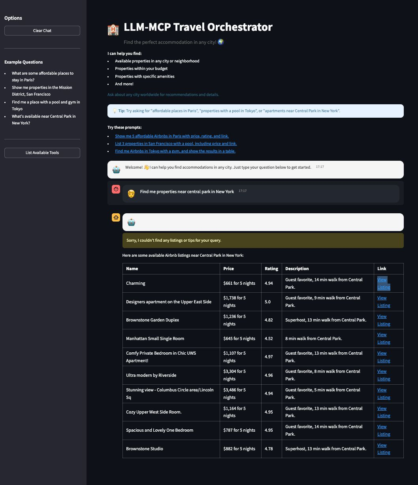

# 🤖 LLM-MCP Travel Orchestrator

A sophisticated multi-agent travel accommodation system that leverages OpenAI's GPT-4o-mini, LangChain, and Multi-Agent Collaboration Protocol (MCP) to provide intelligent property search and recommendations. This system orchestrates multiple AI agents for query parsing, filtering, summarization, and real-time accommodation recommendations.


## 🧠 Technical Architecture

### Multi-Agent System
- **LLM Orchestration**
  - GPT-4o-mini powered natural language understanding
  - Multi-agent collaboration for complex tasks
  - Context-aware conversation management
  - Intelligent response generation

- **LangChain Integration**
  - Chain-of-thought reasoning
  - Tool-based execution
  - Memory management
  - Response formatting

- **MCP Server Integration**
  - Real-time property data access
  - Asynchronous communication
  - Robust error handling
  - Efficient data retrieval

### Core Components
1. **LLM Agent Layer**
   - Query parsing and understanding
   - Context management
   - Response generation
   - Error handling

2. **LangChain Integration Layer**
   - Chain management
   - Tool orchestration
   - Memory handling
   - Response formatting

3. **MCP Integration Layer**
   - Server communication
   - Session management
   - Data synchronization
   - Connection handling

4. **User Interface Layer**
   - Interactive chat interface
   - Dynamic property display
   - Responsive design
   - Real-time updates

## 🚀 Getting Started

### Prerequisites
- Python 3.11 or higher
- Node.js and npm
- OpenAI API key (Get one from [OpenAI Platform](https://platform.openai.com))

### Installation

1. **Clone the Repository**
```bash
git clone https://github.com/ANUVIK2401/MCP_Agent_Airbnb.git
cd MCP_Agent_Airbnb
```

2. **Set Up Virtual Environment**
```bash
# Create virtual environment
python -m venv venv

# Activate virtual environment
# On macOS/Linux:
source venv/bin/activate
# On Windows:
.\venv\Scripts\activate
```

3. **Install Dependencies**
```bash
# Install Python packages
pip install -r requirements.txt

# Install MCP server
npm install -g @openbnb/mcp-server-airbnb
```

4. **Configure Environment**
Create a `.env` file in the project root:
```bash
# Create .env file
touch .env  # On macOS/Linux
# OR
type nul > .env  # On Windows
```

Add your OpenAI API key to the `.env` file:
```env
OPENAI_API_KEY=your_api_key_here
```

> ⚠️ **Important**: Never commit your `.env` file or share your API key. The `.env` file is already in `.gitignore` for security.

### Running the Application

1. **Start the Application**
```bash
streamlit run chatbot.py
```

2. **Access the Interface**
Open your browser and navigate to:
```
http://localhost:8501
```

## 💡 Usage Guide

### Basic Queries
- Property search by location
- Amenity-based filtering
- Price range specifications
- Location-based recommendations

### Advanced Features
- Multi-agent collaboration
- Context-aware conversations
- Dynamic filtering options
- Personalized recommendations

### 📸 Working Screenshots

Below are some screenshots demonstrating the working of the application:

#### 1. Main Chatbot Interface


#### 2. Property Search Results


#### 3. Multi-Agent Collaboration in Action


#### 4. Real-Time Recommendations


## 🛠️ Development

### Project Structure
```
MCP_Agent_Airbnb/
├── chatbot.py           # Main application
├── airbnb_mcp.json     # MCP configuration
├── requirements.txt    # Dependencies
├── .env               # Environment variables (create this)
└── .gitignore        # Git ignore rules
```

### Key Dependencies
- streamlit==1.32.0
- python-dotenv==1.0.0
- mcp-use==1.1.5
- langchain-openai>=0.0.5
- langchain-community>=0.0.34
- langchain>=0.1.16

### Development Setup
1. Fork the repository
2. Create a feature branch
3. Set up your development environment
4. Make your changes
5. Test thoroughly
6. Submit a pull request

## 🔒 Security Considerations

- Keep your API keys secure
- Never commit sensitive information
- Use environment variables
- Regular dependency updates
- Follow security best practices

## 🤝 Contributing

1. Fork the repository
2. Create your feature branch (`git checkout -b feature/AmazingFeature`)
3. Commit your changes (`git commit -m 'Add some AmazingFeature'`)
4. Push to the branch (`git push origin feature/AmazingFeature`)
5. Open a Pull Request

## 📝 License

This project is licensed under the MIT License - see the [LICENSE](LICENSE) file for details.

## 🙏 Acknowledgments

- [openbnb-org/mcp-server-airbnb](https://github.com/openbnb-org/mcp-server-airbnb) for the MCP server
- OpenAI for the GPT models
- LangChain for the agent framework
- Streamlit for the web framework

## 📞 Support

For support:
1. Check the [Issues](https://github.com/ANUVIK2401/MCP_Agent_Airbnb/issues) page
2. Create a new issue if your problem isn't already listed
3. Contact the maintainers for urgent issues

---

Made with ❤️ by [Anuvik Thota]
